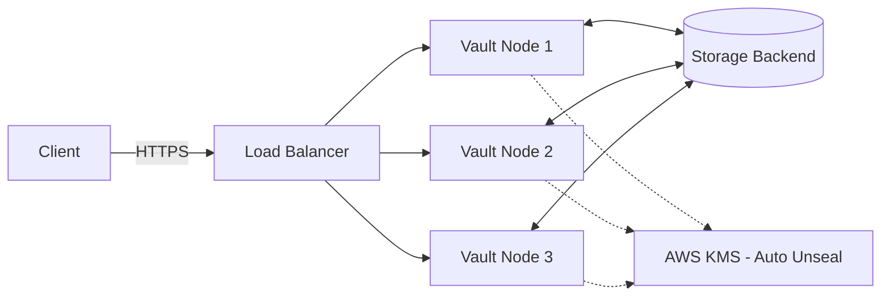

# Architecture

!!! note "Not started yet"
    Diagram and component breakdown go here once the topology is decided (single node vs.
    HA cluster, storage backend, load balancer, KMS auto-unseal, network layout).

*Placeholder diagram — update once the real topology is confirmed.*
