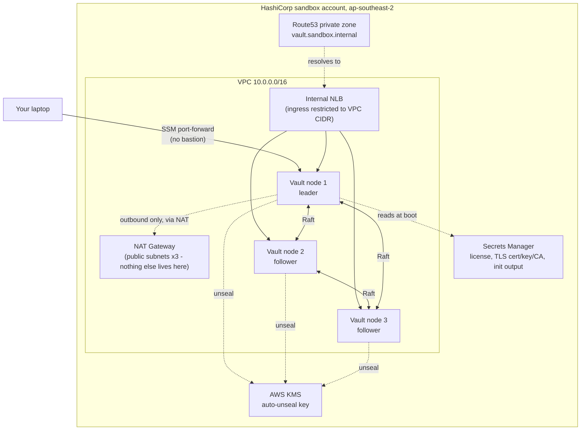

# Architecture

The real, deployed topology — see [Planning & Prerequisites](../guide/01-planning.md) and
[Installing Vault Enterprise](../guide/03-installation.md) for how each piece got built.

## Components

- **VPC** — 3 AZs, public subnets exist only to host the NAT Gateway; private subnets hold
  both the Vault nodes and the internal load balancer.
- **Load balancer** — internal-scheme NLB (module default), never internet-facing. Ingress
  restricted to the VPC's own CIDR — nothing outside can reach it regardless of DNS.
- **Vault nodes** — 3x EC2 in an Auto Scaling Group, Integrated Storage (Raft) for HA, no
  separate storage backend (no Consul).
- **Auto-unseal** — AWS KMS, dedicated key. No Shamir unseal keys; `operator init` instead
  produces recovery key shares (for operations like root-token regeneration, not routine
  unsealing).
- **TLS** — self-signed CA + leaf cert for `vault.sandbox.internal`, generated declaratively
  via the `tls` Terraform provider.
- **DNS** — Route53 **private** hosted zone, associated with the VPC. Doesn't validate
  ownership (only public zones do), which is what let this avoid depending on a real domain.
- **Access** — SSM port-forwarding straight to a node's own port, no bastion host, no public
  ingress path at all.

## Not yet built

PKI and Namespaces — see the [guide](../guide/index.md) for what's next. Static secrets
(KV v2), a least-privilege policy, an AWS auth method, and dynamic AWS credentials via the
AWS secrets engine are already live, all Terraform-managed — see
[Configuration](../guide/04-configuration.md).
